# Diagramas

## Diagrama de casos de uso

## Diagrama de dominio

## Diagrama entidad-relación

## Diagrama de estados de la solicitud de licencia

## Diagrama de estados de la notificación de horas extras

## Diagrama de arquitectura

## Diagrama de despliegue

