# Casos de uso

- [CU-01 Solicitar licencia](#cu-01-solicitar-licencia)
- [CU-02 Evaluar licencia](#cu-02-evaluar-licencia)
- [CU-03 Notificar horas extras](#cu-03-notificar-horas-extras)
- [CU-04 Evaluar horas extras](#cu-04-evaluar-horas-extras)
- [CU-05 Consultar estado de solicitud](#cu-05-consultar-estado-de-solicitud)
- [CU-06 Consultar estado de horas extras](#cu-06-consultar-estado-de-horas-extras)
- [CU-07 Cancelar solicitud de licencia](#cu-07-cancelar-solicitud-de-licencia)
- [CU-08 Cancelar notificación de horas extras](#cu-08-cancelar-notificación-de-horas-extras)
- [CU-09 Ver reporte mensual](#cu-09-ver-reporte-mensual)
- [CU-10 ABM empleados](#cu-10-abm-empleados)
- [CU-11 ABM convenios de trabajo](#cu-11-abm-convenios-de-trabajo)

## CU-01 Solicitar licencia

Permite al empleado generar una solicitud formal de licencia a través del sistema, indicando el tipo de licencia, el rango de fechas y el motivo, con la posibilidad de adjuntar documentación respaldatoria digital.

El sistema valida la solicitud contra las reglas del convenio de trabajo asociado al legajo del empleado ([CU-11](#cu-11-abm-convenios-de-trabajo)): tipos de licencia admitidos, cantidad de días disponibles, antelación mínima exigida y documentación obligatoria. Cada tipo tiene reglas propias: algunos requieren documentación obligatoria, otros descuentan del saldo anual y otros no tienen límite de días.

La solicitud queda en estado 'Pendiente' hasta que RRHH la evalúe ([CU-02](#cu-02-evaluar-licencia)), y genera una notificación automática al área de Recursos Humanos ([RF-08](requirements.md#rf-08)). El empleado puede consultar el estado en cualquier momento ([CU-05](#cu-05-consultar-estado-de-solicitud)) y cancelarla mientras no haya sido resuelta ([CU-07](#cu-07-cancelar-solicitud-de-licencia)). Toda la operación queda asentada en el log de auditoría con usuario, fecha y hora ([RNF-04](requirements.md#rnf-04)).

- **Actores**
  - Empleado (primario)
  - Sistema (secundario: notificación automática a RRHH)

- **Referencias a otros CU**
  - [CU-02 Evaluar licencia](#cu-02-evaluar-licencia)
  - [CU-05 Consultar estado de solicitud](#cu-05-consultar-estado-de-solicitud)
  - [CU-07 Cancelar solicitud de licencia](#cu-07-cancelar-solicitud-de-licencia)
  - [CU-11 ABM convenios de trabajo](#cu-11-abm-convenios-de-trabajo)

### Flujo normal

| Usuario | Sistema | Observaciones |
| :--- | :--- | :--- |
| Accede al módulo 'Mis Licencias' y selecciona la opción 'Nueva solicitud'. | Verifica el rol del usuario y presenta el formulario con los campos: tipo de licencia, fecha de inicio, fecha de fin, motivo y campo para adjuntar documentación. | Los tipos de licencia ofrecidos surgen del convenio asociado al empleado. |
| Selecciona el tipo de licencia. | Muestra información contextual según el convenio: días disponibles, documentación requerida y antelación mínima exigida para ese tipo. | |
| Completa las fechas de inicio y de fin. | Calcula automáticamente la cantidad de días hábiles solicitados, verifica que el saldo disponible sea suficiente y que se respete la antelación mínima. | El cálculo contempla fines de semana y feriados. |
| Adjunta la documentación respaldatoria (si corresponde) y confirma el envío. | Registra la solicitud en estado 'Pendiente', asigna un número de seguimiento único, notifica automáticamente a RRHH y registra el evento en el log de auditoría. | La notificación a RRHH es automática ([RF-08](requirements.md#rf-08)). |
| Visualiza la confirmación. | Muestra el número de seguimiento, el resumen de la solicitud y el acceso directo a la consulta de estado ([CU-05](#cu-05-consultar-estado-de-solicitud)). | |

### Flujo alternativo #1: Saldo de días insuficiente

| Usuario | Sistema | Observaciones |
| :--- | :--- | :--- |
| Selecciona un tipo de licencia con cupo anual y completa las fechas. | Detecta que los días solicitados superan el saldo disponible. Muestra: 'Saldo disponible: X días. Días solicitados: Y días. No es posible continuar'. | Regla definida en el convenio ([CU-11](#cu-11-abm-convenios-de-trabajo)). |
| Ajusta el rango de fechas o cancela la solicitud. | Vuelve al formulario conservando los datos ya ingresados para que el empleado los corrija. | |

### Flujo alternativo #2: Superposición con otra licencia

| Usuario | Sistema | Observaciones |
| :--- | :--- | :--- |
| Selecciona fechas que se superponen con una licencia ya aprobada o con una solicitud pendiente. | Detecta el conflicto, muestra las fechas ya ocupadas e impide continuar hasta que el empleado corrija el rango. | No se genera ningún registro nuevo. |

### Flujo alternativo #3: Documentación obligatoria faltante

| Usuario | Sistema | Observaciones |
| :--- | :--- | :--- |
| Confirma el envío sin adjuntar la documentación exigida por el convenio para ese tipo de licencia. | Bloquea el envío e indica qué documentación es obligatoria. | |
| Adjunta el archivo y vuelve a confirmar. | Valida el formato y el tamaño del archivo y continúa con el flujo normal. | Formatos admitidos: PDF, JPG, PNG. |

## CU-02 Evaluar licencia

Permite al área de Recursos Humanos revisar y resolver las solicitudes de licencia enviadas por los empleados. RRHH puede aprobar o rechazar una solicitud y debe registrar una observación cuando la rechaza ([RF-03](requirements.md#rf-03)).

Al resolverse la solicitud, el sistema notifica automáticamente al empleado con el resultado y las observaciones registradas. Si la solicitud es aprobada y el tipo descuenta cupo, el sistema descuenta los días del saldo del empleado y las fechas quedan disponibles para el reporte mensual ([CU-09](#cu-09-ver-reporte-mensual)).

Sólo los usuarios con rol RRHH acceden a este caso de uso ([RNF-01](requirements.md#rnf-01)). La decisión queda registrada en el log de auditoría con usuario, fecha y hora ([RNF-04](requirements.md#rnf-04)).

- **Actores**
  - RRHH (primario)
  - Sistema (secundario: notificación automática al empleado)

- **Referencias a otros CU**
  - [CU-01 Solicitar licencia](#cu-01-solicitar-licencia)
  - [CU-05 Consultar estado de solicitud](#cu-05-consultar-estado-de-solicitud)
  - [CU-09 Ver reporte mensual](#cu-09-ver-reporte-mensual)

### Flujo normal

| Usuario | Sistema | Observaciones |
| :--- | :--- | :--- |
| Accede al módulo 'Gestión de licencias'. | Verifica el rol RRHH y muestra el listado de solicitudes pendientes ordenadas por fecha de envío ascendente. | Permite filtrar por área, empleado, tipo y período. |
| Selecciona una solicitud para revisar su detalle. | Muestra: empleado, área, tipo de licencia, motivo, rango de fechas, días solicitados, saldo disponible y documentación adjunta. | |
| Revisa la información y selecciona una acción: Aprobar o Rechazar. | Solicita el ingreso de una observación, obligatoria si la acción es 'Rechazar'. | |
| Ingresa la observación y confirma la decisión. | Actualiza el estado de la solicitud, registra la decisión con usuario, fecha y hora, y descuenta los días del saldo del empleado si la licencia fue aprobada y el tipo descuenta cupo. | Registro en log de auditoría ([RNF-04](requirements.md#rnf-04)). |
| Vuelve al listado. | Envía la notificación automática al empleado con el resultado y las observaciones, y actualiza el listado de pendientes. | |

### Flujo alternativo #1: Solicitud con fechas ya vencidas

| Usuario | Sistema | Observaciones |
| :--- | :--- | :--- |
| Intenta evaluar una solicitud cuyo rango de fechas ya transcurrió. | Muestra la advertencia: 'Las fechas de esta solicitud ya han vencido. La decisión quedará registrada como histórico'. | |
| Confirma la decisión. | Registra la resolución en el historial de auditoría y la incluye en el reporte del período correspondiente. | |

### Flujo alternativo #2: Solicitud cancelada por el empleado

| Usuario | Sistema | Observaciones |
| :--- | :--- | :--- |
| Selecciona una solicitud que el empleado canceló mientras estaba siendo evaluada ([CU-07](#cu-07-cancelar-solicitud-de-licencia)). | Informa que la solicitud fue cancelada por el empleado, muestra la fecha y hora de la cancelación e impide registrar una decisión sobre ella. | El estado 'Cancelada' es terminal. |

### Flujo alternativo #3: Rechazo sin observación

| Usuario | Sistema | Observaciones |
| :--- | :--- | :--- |
| Selecciona 'Rechazar' y confirma sin completar el campo de observación. | Bloquea la confirmación e indica que la observación es obligatoria para rechazar o poner en revisión una solicitud. | |

## CU-03 Notificar horas extras

Permite al empleado declarar formalmente las horas trabajadas por fuera de su jornada habitual, indicando la fecha, el horario de inicio y de fin, y el motivo de la extensión, pudiendo adjuntar la autorización previa de su responsable ([RF-04](requirements.md#rf-04)).

A partir de los datos ingresados, el sistema calcula automáticamente la cantidad de horas declaradas y determina el multiplicador de remuneración que corresponde según el convenio de trabajo del empleado ([CU-11](#cu-11-abm-convenios-de-trabajo)), por ejemplo 50% para días hábiles y 100% para sábados después del mediodía, domingos y feriados ([RF-01](requirements.md#rf-01)). El sistema no trabaja con montos de dinero: sólo registra la cantidad de horas y el porcentaje aplicable.

La notificación queda en estado 'Pendiente' hasta que RRHH la evalúe ([CU-04](#cu-04-evaluar-horas-extras)) y dispara una notificación automática al área ([RF-08](requirements.md#rf-08)).

- **Actores**
  - Empleado (primario)
  - Sistema (secundario: cálculo de horas y notificación a RRHH)

- **Referencias a otros CU**
  - [CU-06 Consultar estado de horas extras](#cu-06-consultar-estado-de-horas-extras)
  - [CU-08 Cancelar notificación de horas extras](#cu-08-cancelar-notificación-de-horas-extras)
  - [CU-11 ABM convenios de trabajo](#cu-11-abm-convenios-de-trabajo)
  - [CU-04 Evaluar horas extras](#cu-04-evaluar-horas-extras)

### Flujo normal

| Usuario | Sistema | Observaciones |
| :--- | :--- | :--- |
| Accede al módulo 'Mis Horas Extra' y selecciona 'Nueva notificación'. | Presenta el formulario con los campos: fecha, hora de inicio, hora de fin y motivo. | |
| Completa la fecha y el rango horario trabajado. | Calcula la cantidad de horas declaradas y determina el multiplicador aplicable según el tipo de día y el convenio del empleado. | Contempla feriados y el corte del sábado al mediodía. |
| Verifica el resumen calculado, ingresa el motivo y adjunta la autorización si corresponde. | Muestra el desglose: cantidad de horas al 50% y al 100%, y el total declarado. | |
| Confirma el envío. | Registra la notificación en estado 'Pendiente', asigna un número de seguimiento, notifica automáticamente a RRHH y registra el evento en el log de auditoría. | Notificación automática ([RF-08](requirements.md#rf-08)). |

### Flujo alternativo #1: Se supera el tope del convenio

| Usuario | Sistema | Observaciones |
| :--- | :--- | :--- |
| Declara una cantidad de horas que excede el tope diario o mensual definido en el convenio. | Muestra la alerta indicando el tope aplicable y las horas ya declaradas en el período. | Tope parametrizado en [CU-11](#cu-11-abm-convenios-de-trabajo). |
| Confirma igualmente el envío o corrige el rango horario. | Si confirma: registra la notificación con la marca 'Excede tope' para que RRHH la revise con prioridad. Si corrige: vuelve al formulario con los datos ingresados. | |

### Flujo alternativo #2: Superposición con otra notificación

| Usuario | Sistema | Observaciones |
| :--- | :--- | :--- |
| Declara un rango horario que se superpone con una notificación ya registrada para la misma fecha. | Detecta el conflicto, muestra la notificación existente e impide continuar hasta que el empleado corrija el rango. | No se genera ningún registro nuevo. |

### Flujo alternativo #3: Período ya cerrado

| Usuario | Sistema | Observaciones |
| :--- | :--- | :--- |
| Selecciona una fecha perteneciente a un período cuyo reporte mensual ya fue cerrado. | Bloquea la carga e informa que el período se encuentra cerrado, indicando que debe gestionarse el reclamo directamente con RRHH. | Preserva la integridad del reporte ya emitido. |

## CU-04 Evaluar horas extras

Permite al área de Recursos Humanos revisar y resolver las notificaciones de horas extra enviadas por los empleados, aprobándolas o rechazándolas ([RF-05](requirements.md#rf-05)). Se requiere una observación obligatoria en caso de rechazo.

RRHH puede además aprobar la notificación con un ajuste sobre la cantidad de horas reconocidas cuando lo declarado no coincide con lo efectivamente autorizado; el ajuste exige justificación y se informa al empleado.

Sólo las horas en estado 'Aprobada' o 'Aprobada con ajuste', por la cantidad reconocida, se incorporan al reporte mensual ([CU-09](#cu-09-ver-reporte-mensual)). Toda decisión queda registrada en el log de auditoría ([RNF-04](requirements.md#rnf-04)).

- **Actores**
  - RRHH (primario)
  - Sistema (secundario: notificación automática al empleado)

- **Referencias a otros CU**
  - [CU-03 Notificar horas extras](#cu-03-notificar-horas-extras)
  - [CU-06 Consultar estado de horas extras](#cu-06-consultar-estado-de-horas-extras)
  - [CU-09 Ver reporte mensual](#cu-09-ver-reporte-mensual)

### Flujo normal

| Usuario | Sistema | Observaciones |
| :--- | :--- | :--- |
| Accede al módulo 'Gestión de horas extra'. | Verifica el rol RRHH y muestra el listado de notificaciones pendientes ordenadas por fecha ascendente, destacando las marcadas como 'Excede tope'. | Permite filtrar por área, empleado y período. |
| Selecciona una notificación para revisar su detalle. | Muestra: empleado, área, fecha, rango horario declarado, horas calculadas, multiplicador aplicable, motivo, autorización adjunta y acumulado del empleado en el período. | |
| Revisa la información y selecciona una acción: Aprobar o Rechazar. | Solicita el ingreso de una observación, obligatoria en caso de rechazo. | |
| Confirma la decisión. | Actualiza el estado de la notificación, registra la decisión con usuario, fecha y hora, incorpora las horas al acumulado del período si fueron aprobadas y notifica automáticamente al empleado. | Registro en log de auditoría ([RNF-04](requirements.md#rnf-04)). |

### Flujo alternativo #1: Aprobación con ajuste de horas

| Usuario | Sistema | Observaciones |
| :--- | :--- | :--- |
| Selecciona 'Aprobar' y modifica la cantidad de horas reconocidas. | Solicita una justificación obligatoria para el ajuste y muestra el nuevo desglose por multiplicador. | |
| Ingresa la justificación y confirma. | Registra el estado 'Aprobada con ajuste' conservando tanto las horas declaradas como las reconocidas, y notifica al empleado el detalle de la diferencia. | Ambos valores quedan visibles en [CU-06](#cu-06-consultar-estado-de-horas-extras). |

### Flujo alternativo #2: Notificación cancelada por el empleado

| Usuario | Sistema | Observaciones |
| :--- | :--- | :--- |
| Selecciona una notificación que el empleado canceló mientras estaba siendo evaluada ([CU-08](#cu-08-cancelar-notificación-de-horas-extras)). | Informa que la notificación fue cancelada, muestra la fecha y hora de la cancelación e impide registrar una decisión sobre ella. | |

### Flujo alternativo #3: Período cerrado

| Usuario | Sistema | Observaciones |
| :--- | :--- | :--- |
| Intenta resolver una notificación correspondiente a un período cuyo reporte ya fue cerrado. | Advierte que la decisión no impactará en el reporte ya emitido y que quedará registrada como ajuste del período siguiente. | |

## CU-05 Consultar estado de solicitud

Permite al empleado consultar el historial completo de sus solicitudes de licencia y el estado actual de cada una: Pendiente, En revisión, Aprobada, Rechazada o Cancelada, junto con las observaciones ingresadas por RRHH al resolverlas ([RF-06](requirements.md#rf-06)).

Este caso de uso no permite modificar los datos de la solicitud original. Desde el detalle de una solicitud aún no resuelta, el empleado puede extender el flujo hacia la cancelación ([CU-07](#cu-07-cancelar-solicitud-de-licencia)).

Por aplicación del control de acceso basado en roles, el empleado sólo visualiza sus propias solicitudes ([RNF-01](requirements.md#rnf-01)).

- **Actores**
  - Empleado (primario)

- **Referencias a otros CU**
  - [CU-01 Solicitar licencia](#cu-01-solicitar-licencia)
  - [CU-02 Evaluar licencia](#cu-02-evaluar-licencia)
  - [CU-07 Cancelar solicitud de licencia](#cu-07-cancelar-solicitud-de-licencia)

### Flujo normal

| Usuario | Sistema | Observaciones |
| :--- | :--- | :--- |
| Accede al módulo 'Mis Licencias'. | Recupera y muestra el listado de todas las solicitudes del empleado autenticado, ordenadas por fecha de envío descendente, con el estado de cada una resaltado visualmente. | Pendiente: amarillo / En revisión: azul / Aprobada: verde / Rechazada: rojo / Cancelada: gris |
| Selecciona una solicitud para ver su detalle. | Muestra: número de seguimiento, tipo de licencia, rango de fechas, días solicitados, fecha de envío, estado actual, usuario de RRHH que la resolvió, fecha de resolución y observaciones. | |
| Revisa la información y vuelve al listado. | Regresa al listado general de solicitudes. | |

### Flujo alternativo #1: El empleado no tiene solicitudes previas

| Usuario | Sistema | Observaciones |
| :--- | :--- | :--- |
| Accede al módulo 'Mis Licencias'. | Muestra el listado vacío con el mensaje: 'Todavía no realizaste ninguna solicitud de licencia' y ofrece acceso directo al formulario de nueva solicitud ([CU-01](#cu-01-solicitar-licencia)). | |

### Flujo alternativo #2: Filtrado por estado o período

| Usuario | Sistema | Observaciones |
| :--- | :--- | :--- |
| Aplica un filtro por estado, por tipo de licencia o por rango de fechas. | Actualiza el listado mostrando únicamente las solicitudes que coinciden con los criterios seleccionados. | Ej.: ver sólo las solicitudes 'Rechazadas' del año en curso. |

## CU-06 Consultar estado de horas extras

Permite al empleado consultar el historial de sus notificaciones de horas extra y el estado de cada una: Pendiente, Aprobada, Aprobada con ajuste, Rechazada o Cancelada, junto con las observaciones de RRHH ([RF-06](requirements.md#rf-06)).

Además del listado, el sistema presenta un resumen acumulado del período en curso con las horas aprobadas discriminadas por multiplicador, lo que permite al empleado anticipar el contenido de su liquidación.

Este caso de uso no permite modificar datos. Desde el detalle de una notificación aún no resuelta, el empleado puede extender el flujo hacia la cancelación ([CU-08](#cu-08-cancelar-notificación-de-horas-extras)).

- **Actores**
  - Empleado (primario)

- **Referencias a otros CU**
  - [CU-03 Notificar horas extras](#cu-03-notificar-horas-extras)
  - [CU-08 Cancelar notificación de horas extras](#cu-08-cancelar-notificación-de-horas-extras)
  - [CU-04 Evaluar horas extras](#cu-04-evaluar-horas-extras)

### Flujo normal

| Usuario | Sistema | Observaciones |
| :--- | :--- | :--- |
| Accede al módulo 'Mis Horas Extra'. | Muestra el resumen del mes en curso (horas al 50%, horas al 100% y total aprobado) y el listado de notificaciones ordenado por fecha descendente con el estado resaltado. | Sólo se acumulan en el resumen las horas en estado 'Aprobada'. |
| Selecciona una notificación para ver su detalle. | Muestra: número de seguimiento, fecha, rango horario declarado, horas calculadas, multiplicador aplicado, estado, usuario de RRHH que la resolvió, fecha de resolución y observaciones. | Si hubo ajuste, muestra las horas declaradas y las reconocidas. |
| Revisa la información y vuelve al listado. | Regresa al listado general de notificaciones. | |

### Flujo alternativo #1: El empleado no tiene notificaciones previas

| Usuario | Sistema | Observaciones |
| :--- | :--- | :--- |
| Accede al módulo 'Mis Horas Extra'. | Muestra el listado vacío con el mensaje: 'Todavía no notificaste horas extra' y ofrece acceso directo al formulario de nueva notificación ([CU-03](#cu-03-notificar-horas-extras)). | |

### Flujo alternativo #2: Consulta de un período anterior

| Usuario | Sistema | Observaciones |
| :--- | :--- | :--- |
| Selecciona un mes y año distintos del período en curso. | Recalcula el resumen y el listado para el período seleccionado e indica si el reporte de ese período ya fue cerrado. | Los períodos cerrados se muestran en modo sólo lectura. |

## CU-07 Cancelar solicitud de licencia

Extiende a [CU-05](#cu-05-consultar-estado-de-solicitud). Permite al empleado dejar sin efecto una solicitud de licencia que él mismo generó, dando de baja el trámite sin eliminar el registro histórico.

La cancelación está habilitada mientras la solicitud se encuentre en estado 'Pendiente' o 'En revisión'. También se admite sobre una licencia ya aprobada cuya fecha de inicio sea posterior al día de la cancelación; en ese caso el sistema reintegra los días al saldo del empleado y notifica a RRHH del cambio.

La solicitud pasa al estado terminal 'Cancelada' y el evento queda registrado en el log de auditoría con usuario, fecha y hora ([RNF-04](requirements.md#rnf-04)).

- **Actores**
  - Empleado (primario)
  - Sistema (secundario: notificación a RRHH)

- **Referencias a otros CU**
  - [CU-01 Solicitar licencia](#cu-01-solicitar-licencia)
  - [CU-02 Evaluar licencia](#cu-02-evaluar-licencia)
  - [CU-05 Consultar estado de solicitud](#cu-05-consultar-estado-de-solicitud)

### Flujo normal

| Usuario | Sistema | Observaciones |
| :--- | :--- | :--- |
| Desde el detalle de una solicitud ([CU-05](#cu-05-consultar-estado-de-solicitud)), selecciona la opción 'Cancelar solicitud'. | Verifica que el estado de la solicitud admita la cancelación y solicita el ingreso de un motivo de cancelación. | Estados habilitados: Pendiente y En revisión. |
| Ingresa el motivo y confirma la acción. | Solicita la confirmación definitiva advirtiendo que la operación no puede deshacerse. | |
| Confirma. | Actualiza el estado a 'Cancelada', retira la solicitud de la bandeja de pendientes de RRHH, notifica al área y registra el evento en el log de auditoría. | |

### Flujo alternativo #1: Licencia aprobada con fecha de inicio futura

| Usuario | Sistema | Observaciones |
| :--- | :--- | :--- |
| Solicita la cancelación de una licencia ya aprobada que aún no comenzó. | Advierte que la licencia fue aprobada y que la cancelación reintegrará los días al saldo disponible. | |
| Confirma la cancelación. | Actualiza el estado, reintegra los días al saldo del empleado, notifica a RRHH y registra el evento en auditoría. | |

### Flujo alternativo #2: Licencia ya iniciada o finalizada

| Usuario | Sistema | Observaciones |
| :--- | :--- | :--- |
| Intenta cancelar una licencia aprobada cuyo rango de fechas ya comenzó. | Bloquea la acción e informa que la licencia ya se encuentra en curso o finalizada, indicando que el ajuste debe gestionarse con RRHH. | Preserva la consistencia del reporte mensual. |

## CU-08 Cancelar notificación de horas extras

Extiende a [CU-06](#cu-06-consultar-estado-de-horas-extras). Permite al empleado dejar sin efecto una notificación de horas extra que él mismo generó, por ejemplo ante un error de carga en la fecha o en el rango horario declarado.

La cancelación está habilitada mientras la notificación se encuentre en estado 'Pendiente', y también sobre notificaciones ya aprobadas cuyo período mensual todavía no haya sido cerrado.

La notificación pasa al estado terminal 'Cancelada', deja de computar en el resumen del período y el evento queda registrado en el log de auditoría ([RNF-04](requirements.md#rnf-04)).

- **Actores**
  - Empleado (primario)
  - Sistema (secundario: notificación a RRHH)

- **Referencias a otros CU**
  - [CU-03 Notificar horas extras](#cu-03-notificar-horas-extras)
  - [CU-06 Consultar estado de horas extras](#cu-06-consultar-estado-de-horas-extras)
  - [CU-04 Evaluar horas extras](#cu-04-evaluar-horas-extras)

### Flujo normal

| Usuario | Sistema | Observaciones |
| :--- | :--- | :--- |
| Desde el detalle de una notificación ([CU-06](#cu-06-consultar-estado-de-horas-extras)), selecciona la opción 'Cancelar notificación'. | Verifica que el estado y el período admitan la cancelación y solicita el ingreso de un motivo. | |
| Ingresa el motivo y confirma la acción. | Solicita la confirmación definitiva advirtiendo que la operación no puede deshacerse. | |
| Confirma. | Actualiza el estado a 'Cancelada', descuenta las horas del acumulado del período, retira la notificación de la bandeja de pendientes de RRHH y registra el evento en auditoría. | |
| Visualiza el resultado. | Muestra la confirmación y el resumen del período actualizado. | |

### Flujo alternativo #1: Notificación ya aprobada en período abierto

| Usuario | Sistema | Observaciones |
| :--- | :--- | :--- |
| Solicita la cancelación de una notificación aprobada por RRHH cuyo período aún no fue cerrado. | Advierte que las horas fueron aprobadas y que la cancelación las quitará del acumulado del mes. | |
| Confirma la cancelación. | Actualiza el estado, recalcula el acumulado del período y notifica a RRHH del cambio. | |

### Flujo alternativo #2: Período cerrado

| Usuario | Sistema | Observaciones |
| :--- | :--- | :--- |
| Intenta cancelar una notificación incluida en un reporte mensual ya cerrado. | Bloquea la acción e informa que el período está cerrado, indicando que la corrección debe gestionarse con RRHH. | Garantiza la integridad del reporte emitido. |

## CU-09 Ver reporte mensual

Permite al área de Recursos Humanos visualizar y exportar el reporte mensual consolidado de horas extra y licencias por empleado, insumo de los procedimientos posteriores de liquidación de sueldos ([RF-07](requirements.md#rf-07)).

El reporte presenta, para cada empleado del período seleccionado: las horas extra aprobadas discriminadas por multiplicador de remuneración, los días de licencia aprobados agrupados por tipo y el saldo de días restante. De acuerdo con el alcance definido, el sistema no calcula ni muestra montos de dinero: informa el desglose de horas y el porcentaje o multiplicador aplicable a cada una.

El reporte puede exportarse en formato PDF para su distribución ([RNF-05](requirements.md#rnf-05)). El acceso está restringido al rol RRHH ([RNF-01](requirements.md#rnf-01)).

- **Actores**
  - RRHH (primario)
  - Sistema (secundario: consolidación de datos y generación del archivo)

- **Referencias a otros CU**
  - [CU-02 Evaluar licencia](#cu-02-evaluar-licencia)
  - [CU-04 Evaluar horas extras](#cu-04-evaluar-horas-extras)

### Flujo normal

| Usuario | Sistema | Observaciones |
| :--- | :--- | :--- |
| Accede al módulo 'Reportes' y define los filtros de búsqueda: mes, año y, opcionalmente, empleado o área. | Verifica el rol RRHH y presenta la interfaz de selección de parámetros con el período anterior preseleccionado. | |
| Presiona el botón 'Generar reporte'. | Recupera el reporte consolidado del período o, si se trata de un período abierto, consolida en línea las licencias y horas extra aprobadas. | Sólo se incluyen los registros en estado 'Aprobada'. |
| Visualiza el resumen en pantalla. | Muestra, por empleado: horas extra al 50%, horas extra al 100%, total de horas extra, días de licencia por tipo y saldo de días restante. Incluye totales por área. | |
| Selecciona la opción 'Exportar a PDF'. | Genera el archivo PDF con el detalle del período, la fecha y hora de emisión y el usuario que lo solicitó, y registra la descarga en el log de auditoría. | Exportación en PDF ([RNF-05](requirements.md#rnf-05)). |

### Flujo alternativo #1: Sin datos en el período seleccionado

| Usuario | Sistema | Observaciones |
| :--- | :--- | :--- |
| Solicita la generación del reporte para un período o un empleado determinado. | Verifica que no existan licencias ni horas extra aprobadas para esos criterios y notifica que no se encontraron datos para procesar el informe. | No se genera archivo de exportación. |

### Flujo alternativo #2: Existen solicitudes pendientes de resolución

| Usuario | Sistema | Observaciones |
| :--- | :--- | :--- |
| Solicita el reporte de un período que aún registra solicitudes o notificaciones sin resolver. | Muestra una advertencia con la cantidad de registros pendientes y ofrece el acceso directo a su evaluación ([CU-02](#cu-02-evaluar-licencia) y [CU-04](#cu-04-evaluar-horas-extras)). | |
| Continúa con la generación o va a resolver los pendientes. | Si continúa: genera el reporte excluyendo los registros no aprobados y lo marca como 'provisorio'. | |

## CU-10 ABM empleados

Permite al personal de Recursos Humanos gestionar el legajo digital de los trabajadores: el alta de nuevos perfiles, la actualización de los datos existentes y la baja de empleados.

En el alta se asocia al empleado un convenio de trabajo ([CU-11](#cu-11-abm-convenios-de-trabajo)), que determina las reglas de licencias y horas extra que le serán aplicadas, y un rol del sistema (Empleado o RRHH) que define sus privilegios de acceso ([RNF-01](requirements.md#rnf-01)).

Las bajas son lógicas: el registro no se elimina, de modo de preservar la trazabilidad histórica de sus solicitudes y notificaciones en los reportes de períodos anteriores ([RNF-04](requirements.md#rnf-04)).

- **Actores**
  - RRHH (primario)

- **Referencias a otros CU**
  - [CU-11 ABM convenios de trabajo](#cu-11-abm-convenios-de-trabajo)

### Flujo normal

| Usuario | Sistema | Observaciones |
| :--- | :--- | :--- |
| Accede al módulo de legajos y selecciona la opción 'Nuevo empleado'. | Muestra el formulario de carga con los campos: nombre y apellido, CUIL, correo electrónico, categoría, área, fecha de ingreso, convenio de trabajo, rol del sistema y estado. | El listado de convenios proviene de [CU-11](#cu-11-abm-convenios-de-trabajo). |
| Completa los datos requeridos y carga la documentación del legajo. | Valida que los campos obligatorios estén completos, que el formato del CUIL y del correo sea correcto y que el CUIL no esté ya registrado. | |
| Presiona el botón 'Guardar'. | Registra el nuevo empleado, inicializa el saldo de días de licencia según el convenio asignado, genera las credenciales de acceso y confirma la operación. | El empleado queda habilitado para operar en el sistema. |

### Flujo alternativo #1: Modificación de datos

| Usuario | Sistema | Observaciones |
| :--- | :--- | :--- |
| Busca un empleado en el listado y selecciona la opción 'Editar'. | Recupera y muestra la información actual del empleado en el formulario de edición. | |
| Realiza los cambios necesarios y confirma. | Actualiza el registro y asienta el evento en el log de auditoría con usuario, fecha y hora. | Si se cambia el convenio, las nuevas reglas aplican a las solicitudes futuras. |

### Flujo alternativo #2: Baja de empleado

| Usuario | Sistema | Observaciones |
| :--- | :--- | :--- |
| Selecciona un empleado activo y marca su estado como 'Inactivo'. | Verifica si el empleado tiene solicitudes o notificaciones pendientes y solicita la confirmación para proceder con la baja lógica. | No se eliminan los datos, para asegurar la trazabilidad. |
| Confirma la acción. | Actualiza el estado a 'Inactivo', inhabilita el acceso del empleado al sistema y conserva su historial para los reportes. | |

### Flujo alternativo #3: CUIL ya registrado

| Usuario | Sistema | Observaciones |
| :--- | :--- | :--- |
| Ingresa un CUIL que ya pertenece a otro legajo y confirma el alta. | Bloquea la operación, informa que el CUIL ya se encuentra registrado y ofrece acceder al legajo existente. | Si el legajo está inactivo, ofrece reactivarlo. |

## CU-11 ABM convenios de trabajo

Permite a Recursos Humanos administrar los convenios de trabajo vigentes en la organización y las regulaciones de licencias y horas extra asociadas a cada uno ([RF-09](requirements.md#rf-09)).

Para cada convenio se parametrizan: los tipos de licencia admitidos con su cupo anual, su documentación obligatoria y su antelación mínima; y las reglas de horas extra, es decir los multiplicadores de remuneración por tipo de día y los topes diarios y mensuales admitidos.

Este caso de uso es el que da flexibilidad al sistema: las validaciones de CU-01 y CU-03 y el cálculo del reporte mensual se resuelven leyendo la parametrización definida aquí, sin necesidad de modificar el código. Las modificaciones se versionan para no alterar solicitudes ya resueltas.

- **Actores**
  - RRHH (primario)

- **Referencias a otros CU**
  - [CU-01 Solicitar licencia](#cu-01-solicitar-licencia)
  - [CU-03 Notificar horas extras](#cu-03-notificar-horas-extras)
  - [CU-10 ABM empleados](#cu-10-abm-empleados)

### Flujo normal

| Usuario | Sistema | Observaciones |
| :--- | :--- | :--- |
| Accede al módulo 'Convenios' y selecciona 'Nuevo convenio'. | Muestra el formulario con los datos generales del convenio: nombre, identificación, fecha de vigencia y descripción. | |
| Define los tipos de licencia admitidos. | Permite cargar, para cada tipo: denominación, cupo anual de días, si descuenta saldo, documentación obligatoria y antelación mínima de solicitud. | |
| Define las reglas de horas extra. | Permite cargar los multiplicadores por tipo de día (hábil, sábado después del mediodía, domingo y feriado) y los topes diario y mensual. | Los multiplicadores se expresan como porcentaje. |
| Presiona el botón 'Guardar'. | Valida la consistencia de las reglas cargadas, registra el convenio como vigente y lo habilita para ser asignado a empleados ([CU-10](#cu-10-abm-empleados)). | Registro en log de auditoría. |

### Flujo alternativo #1: Modificación de un convenio con empleados asociados

| Usuario | Sistema | Observaciones |
| :--- | :--- | :--- |
| Selecciona un convenio vigente y edita sus reglas. | Advierte la cantidad de empleados alcanzados y solicita la fecha a partir de la cual rigen los cambios. | |
| Indica la fecha de vigencia y confirma. | Genera una nueva versión del convenio, la aplica a las solicitudes y notificaciones posteriores a esa fecha y conserva la versión anterior para los registros ya resueltos. | Las solicitudes resueltas no se recalculan. |

### Flujo alternativo #2: Baja de un convenio con empleados asociados

| Usuario | Sistema | Observaciones |
| :--- | :--- | :--- |
| Selecciona un convenio y solicita darlo de baja. | Detecta que existen empleados activos asociados e impide la baja hasta que sean reasignados a otro convenio, mostrando el listado de legajos afectados. | |

### Flujo alternativo #3: Reglas inconsistentes

| Usuario | Sistema | Observaciones |
| :--- | :--- | :--- |
| Carga un tope mensual de horas extra inferior al tope diario, o un tipo de licencia con cupo anual negativo. | Detecta la inconsistencia, bloquea el guardado e indica qué regla debe corregirse. | |
